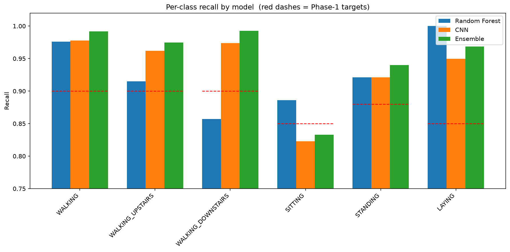
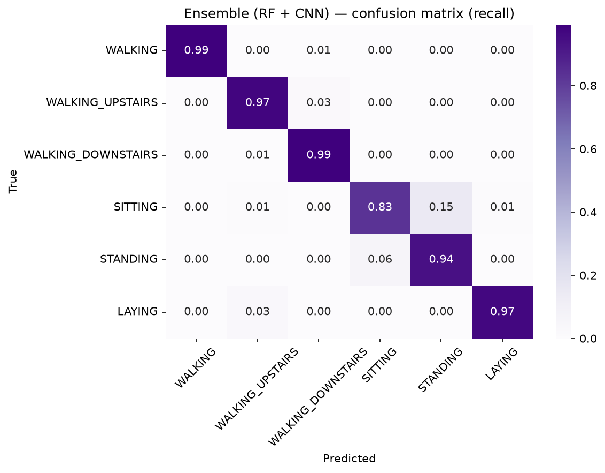

# Human Activity Recognition (HAR) from Wearable Sensor Data

Classifying six physical activities (walking, walking upstairs/downstairs, sitting,
standing, lying) from smartphone accelerometer and gyroscope signals — built end to end
following the **CRISP-DM** methodology, with an emphasis on *explaining every decision*,
not just producing numbers.

**Author:** Abel Raphel Pulikottil · **Status:** ✅ Core analysis complete

---

## Results at a glance

Evaluated on the **subject-independent** test set (9 people the models never saw):

| Model | Test accuracy | Macro-F1 |
|---|---:|---:|
| Random Forest (561 hand-crafted features) | 92.87% | 0.927 |
| 1-D CNN (raw signals, PyTorch, GPU) | 93.35% | 0.934 |
| **Ensemble (RF + CNN, soft vote)** | **94.91%** | **0.950** |

Robustness check — **subject-wise 5-fold cross-validation** (GroupKFold, RF):
**0.938 ± 0.022** accuracy. The fixed-split result sits within this range, confirming it
is representative (and that HAR performance is meaningfully subject-dependent).



---

## Why this project

Human Activity Recognition is the core technology behind **fall detection, elderly-care
monitoring, and rehabilitation tracking** — a key building block in assistive health
systems and healthy-ageing research. Getting *normal* activity recognition right is the
foundation any abnormal-event detector is built on.

## Dataset

[UCI Human Activity Recognition Using Smartphones](https://archive.ics.uci.edu/dataset/240/human+activity+recognition+using+smartphones)
— 30 subjects, 6 activities, waist-mounted smartphone at 50 Hz, segmented into 2.56 s
windows (128 samples). Provided in two forms: **561 pre-computed features** and the
**raw 9-channel signals**. The official split separates people by subject (21 train /
9 test), so models are tested on *new individuals*. *(Data is not committed — see
`.gitignore`; fetch it with `python src/download_data.py`.)*

## Approach (CRISP-DM)

| Phase | What was done | Write-up |
|---|---|---|
| 1 · Business Understanding | Problem framing; per-class recall targets tiered by clinical relevance | [01](reports/01_business_understanding.md) |
| 2 · Data Understanding | Structure, class balance, signal visualization | [02](reports/02_data_understanding.md) |
| 3 · Data Preparation | Subject-independence check, model-ready inputs | [03](reports/03_data_preparation.md) |
| 4 · Modeling | RF baseline + 1-D CNN on raw signals | [04](reports/04_modeling_baseline.md) · [05](reports/05_modeling_deep.md) |
| 5 · Evaluation | Model comparison, ensemble, subject-wise CV | [06](reports/06_evaluation.md) |

## Key findings

- **The models are complementary specialists.** The RF (hand-crafted features) is a
  *posture specialist*; the CNN (raw signals) is a *motion specialist*. The CNN raised
  `WALKING_DOWNSTAIRS` recall from **0.857 → 0.974** by learning the ascent/descent
  temporal asymmetry, while the RF kept the static postures cleaner. Their ensemble beats
  either alone.
- **Ensembling fixes complementary errors, not shared ones.** Downstairs improved because
  the models *disagreed*; `SITTING` did **not** recover because *both* confuse it with
  `STANDING`.
- **SITTING↔STANDING is a fundamental sensor limit.** Two motionless upright postures give
  near-identical gravity signatures on a waist sensor — no model here exceeds ~0.89 recall
  on sitting. This was predicted from the signal physics in Phase 1.



## Limitations & future work

- **Sitting vs. standing** is capped by the sensor placement, not the model — richer
  placement (thigh/chest) or additional sensors would be needed to close it.
- **Controlled-lab data:** a single fixed device placement and scripted activities;
  real-world performance will be lower and should be validated in the field.
- **No fall/adverse-event class:** this recognizes *normal* activities only; "lying"
  cannot distinguish resting from having fallen. Real fall detection needs event data.
- **Single fixed split for the deep model:** the CNN was evaluated on one split (CV was
  applied only to the RF for cost reasons). Full **Leave-One-Subject-Out** CV of all
  models is the natural rigor upgrade.
- **Next steps:** validation-tuned ensemble weights, an LSTM variant, signal augmentation,
  and an interactive Streamlit demo.

## Project structure

```
├── data/          # Raw dataset (git-ignored; fetch via src/download_data.py)
├── notebooks/
│   ├── 01_har_analysis.ipynb   # Phases 2–3: exploration & preparation
│   └── 02_modeling.ipynb       # Phases 4–5: models, ensemble, evaluation
├── src/
│   ├── data.py                 # reusable dataset loaders
│   └── download_data.py        # reproducible dataset download
└── reports/                    # phase write-ups + figures
```

## Reproducing this project

```bash
# 1. Environment (Python 3.12)
py -3.12 -m venv .venv
.venv\Scripts\activate          # Windows
pip install -r requirements.txt

# 2. GPU PyTorch (optional, for the CNN) — CUDA build
pip install torch --index-url https://download.pytorch.org/whl/cu124

# 3. Get the data
python src/download_data.py

# 4. Run the notebooks in order (kernel: "Python (HAR project)")
```

## Roadmap (CRISP-DM)

- [x] Phase 1 — Business Understanding ([write-up](reports/01_business_understanding.md))
- [x] Phase 2 — Data Understanding ([write-up](reports/02_data_understanding.md))
- [x] Phase 3 — Data Preparation ([write-up](reports/03_data_preparation.md))
- [x] Phase 4 — Modeling ([baseline](reports/04_modeling_baseline.md) + [deep](reports/05_modeling_deep.md))
- [x] Phase 5 — Evaluation ([summary](reports/06_evaluation.md))
- [x] Phase 6 — Communication (this README + limitations); *Streamlit demo optional/next*
