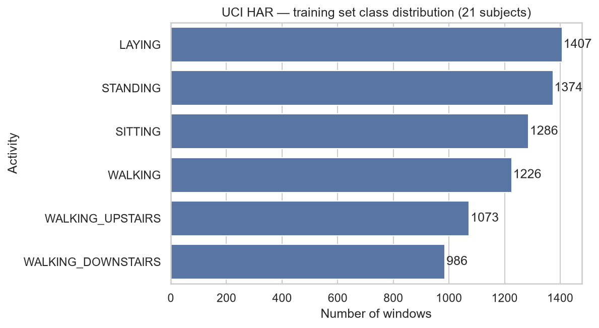
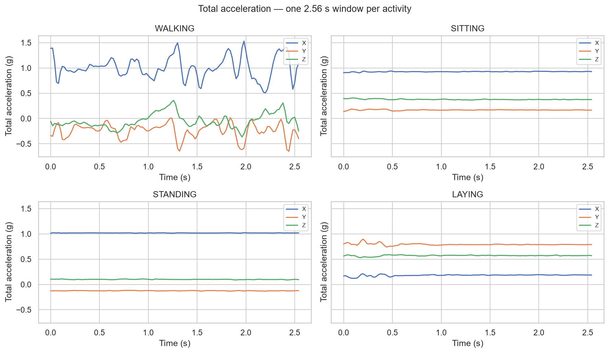

# Phase 2 — Data Understanding

*CRISP-DM Phase 2. Findings from exploring the UCI HAR Dataset before any
preparation or modeling. Full analysis: [`notebooks/01_har_analysis.ipynb`](../notebooks/01_har_analysis.ipynb).*

## Dataset at a glance

- Signals recorded by a **waist-mounted smartphone** (accelerometer + gyroscope)
  sampled at **50 Hz**, segmented into fixed windows of **128 readings (2.56 s)**.
- **~10,299 windows** total from **30 subjects**, pre-split **by subject**:
  **21 people (7,352 windows) for training, 9 people (2,947 windows) for testing.**
- Each window is provided in **two representations**:
  1. **561 pre-computed features** (`X_*.txt`) — hand-engineered time/frequency
     statistics → used for the **baseline** model.
  2. **9 raw signal channels × 128 timesteps** (`Inertial Signals/`) — used for the
     **deep-learning** model.
- Six activity classes: `WALKING`, `WALKING_UPSTAIRS`, `WALKING_DOWNSTAIRS`,
  `SITTING`, `STANDING`, `LAYING`.

## The subject-independent split is real

Training subjects are a specific subset of IDs 1–30
(`1, 3, 5, 6, 7, 8, 11, 14, 15, 16, 17, 19, 21, 22, 23, 25, 26, 27, 28, 29, 30`);
the remaining nine (`2, 4, 9, 10, 12, 13, 18, 20, 24`) form the test set. The model
is therefore evaluated on **people it never saw during training** — the realistic,
harder generalization problem.

## Class balance

| Activity | Windows | Share |
|---|---:|---:|
| LAYING | 1407 | 19.1% |
| STANDING | 1374 | 18.7% |
| SITTING | 1286 | 17.5% |
| WALKING | 1226 | 16.7% |
| WALKING_UPSTAIRS | 1073 | 14.6% |
| WALKING_DOWNSTAIRS | 986 | 13.4% |

**Imbalance ratio ≈ 1.43 — mild.** Static/upright activities are slightly more
frequent than walking activities. `WALKING_DOWNSTAIRS` is the rarest because
descending stairs is faster than ascending, producing shorter signals → fewer
windows. No class is data-starved, so **no resampling is needed**; the Phase-1 plan
(macro-F1 + per-class recall) already handles mild imbalance fairly.

## What the raw signals reveal

One 2.56 s window of total acceleration per activity:

- **WALKING** — large **periodic** oscillations on all axes (footfalls); rich dynamic
  content, easily separable from any static activity.
- **SITTING vs STANDING** — both nearly **flat** (no motion) with gravity (~1 g) on the
  **same axis** (upright posture). They look almost identical → this is the physical
  origin of the expected **SITTING↔STANDING** confusion. The distinguishing signal is
  only a subtle tilt difference.
- **LAYING** — also flat, **but gravity shifts to a different axis** (phone horizontal),
  giving a distinct orientation signature → the easiest class to classify.

**Implication for modeling:** *motion vs. no motion* separates walking from statics;
*which axis carries gravity* separates laying from the upright statics; sitting vs
standing is the genuinely hard pair. We expect the confusion matrix (Phase 5) to
confirm this.

## Data quality

- No missing values in the feature matrix or labels.
- Features are already normalized to roughly [-1, 1] by the dataset authors (checked
  in Phase 3).
