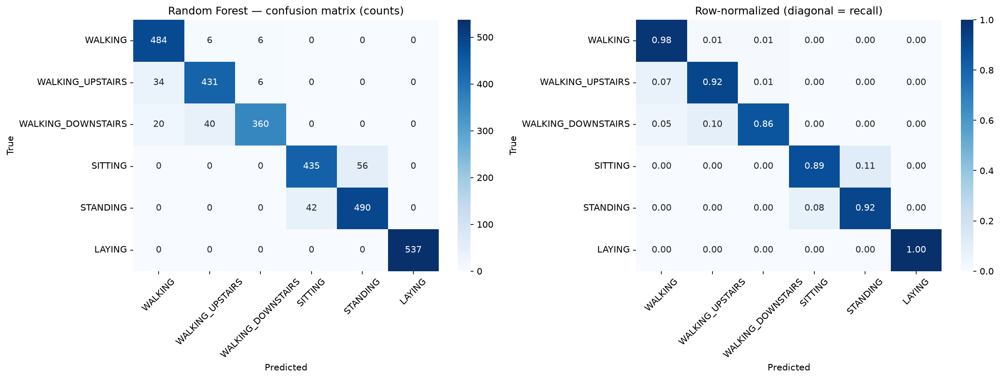

# Phase 4a — Modeling: Random Forest Baseline

*CRISP-DM Phase 4 (baseline). A simple, interpretable model on the 561 pre-computed
features, evaluated on the 9 unseen test subjects. Analysis:
[`notebooks/02_modeling.ipynb`](../notebooks/02_modeling.ipynb).*

## Model

`RandomForestClassifier(n_estimators=300, random_state=42)` trained on the 561
pre-computed features. No scaling applied (Random Forest is scale-invariant, and the
features are already normalized to [-1, 1]).

## Headline result

- **Test accuracy (unseen subjects): 92.87%** — clears the Phase-1 baseline target (≥90%).
- **Macro-F1: 0.927**, **Macro-recall: 0.926** — strong and balanced across classes.

## Per-class recall vs. Phase-1 targets

| Activity | Precision | Recall | Target | Verdict |
|---|---:|---:|---:|:--:|
| WALKING | 0.900 | 0.976 | ≥0.90 | ✅ |
| WALKING_UPSTAIRS | 0.904 | 0.915 | ≥0.90 | ✅ |
| WALKING_DOWNSTAIRS | 0.968 | **0.857** | ≥0.90 | ❌ |
| SITTING | 0.912 | 0.886 | ≥0.85 | ✅ |
| STANDING | 0.897 | 0.921 | ≥0.88 | ✅ |
| LAYING | 1.000 | 1.000 | ≥0.85 | ✅ |

**5 of 6 targets met.** The single miss is WALKING_DOWNSTAIRS recall.

## Confusion matrix and error analysis

The matrix is **block-diagonal**: the three *moving* activities and the three *static*
activities never cross over (those quadrants are all zero). "Motion vs. no motion" is
therefore trivially separable — consistent with the raw-signal plots in Phase 2. Every
error is a subtle *within-family* confusion:

- **DOWNSTAIRS → UPSTAIRS (40) / WALKING (20):** the descent/ascent confusion predicted
  from physics. High precision (0.968) + low recall (0.857) means the model rarely
  *false-labels* downstairs, but *misses* real downstairs, mostly calling them upstairs.
- **SITTING ↔ STANDING (56 and 42):** the entire static-block error — two upright,
  motionless postures with near-identical gravity signatures.
- **LAYING: 537/537 correct** — distinct device orientation, as predicted.

**No pathological confusions** (e.g. LAYING↔WALKING = 0). The baseline fails only in the
*expected* ways, which is the ideal outcome for an interpretable model.

## Takeaways for the deep model (Phase 4b)

- The bar to beat: **92.87% accuracy / 0.927 macro-F1.**
- The specific weakness to target: **WALKING_DOWNSTAIRS recall (0.857)** and, secondarily,
  the SITTING↔STANDING exchange. A model learning features directly from the raw signals
  may capture the fine temporal differences (e.g. the vertical-acceleration asymmetry of
  descending vs. ascending) that the hand-crafted features blur.
