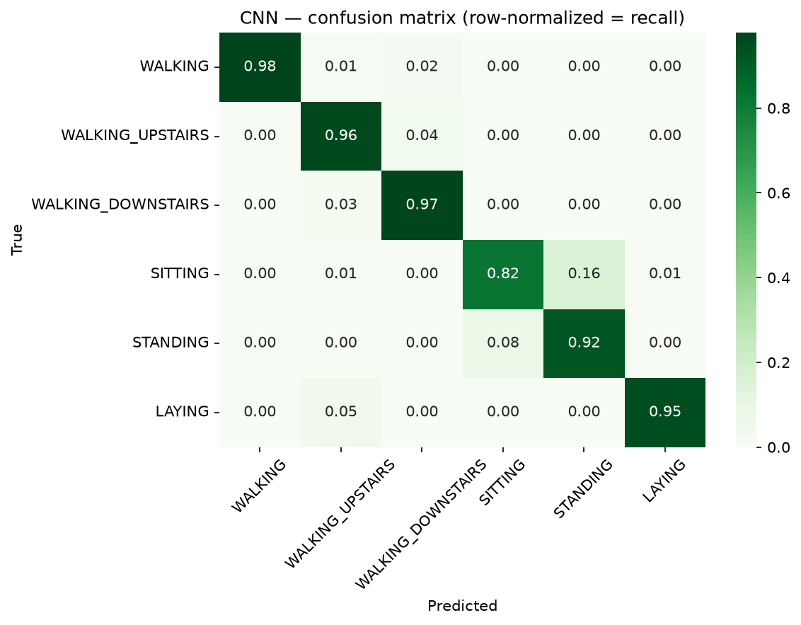

# Phase 4b — Modeling: 1-D CNN on raw signals (+ model comparison)

*CRISP-DM Phase 4 (deep learning). A 1-D convolutional network that learns features
directly from the raw 9-channel signals, trained on GPU (NVIDIA GTX 1650), evaluated
on the same 9 unseen test subjects. Analysis:
[`notebooks/02_modeling.ipynb`](../notebooks/02_modeling.ipynb).*

## Model

A compact 1-D CNN (~49k parameters):

```
Conv1d(9→64, k=5) → BN → ReLU
Conv1d(64→64, k=5) → BN → ReLU → MaxPool(2)
Conv1d(64→128, k=3) → BN → ReLU → MaxPool(2) → Dropout(0.3)
AdaptiveAvgPool → Linear(128→6)
```

Input: standardized raw signals shaped `(batch, 9 channels, 128 timesteps)`. Channels
were standardized using **training statistics only**. Optimizer: Adam (lr 1e-3),
CrossEntropyLoss, 30 epochs, batch size 64.

## Honest evaluation setup

- A **subject-wise validation split** (4 held-out training subjects: 27–30) was used
  for model selection; the **best-validation checkpoint** was restored for test.
- The 9-subject **test set was evaluated once.**
- **Overfitting was observed and expected:** training loss fell to ~0.07 while
  validation loss drifted up to ~0.45 and validation accuracy plateaued near 0.92 from
  the first few epochs — unsurprising given only 17 people in the fit set. Dropout,
  batch-norm, and best-validation checkpointing mitigated it; the checkpoint is taken
  at the validation peak, not the last epoch.

## Result vs. baseline

| Metric | Random Forest (features) | CNN (raw signals) |
|---|---:|---:|
| Test accuracy | 92.87% | **93.35%** |
| Macro-F1 | 0.927 | **0.934** |

The CNN edges out the baseline — a small but real improvement that justifies its
complexity.

## Per-class recall: a physics-driven trade-off

| Activity | RF recall | CNN recall | Target | RF | CNN |
|---|---:|---:|---:|:--:|:--:|
| WALKING | 0.976 | 0.978 | ≥0.90 | ✅ | ✅ |
| WALKING_UPSTAIRS | 0.915 | 0.962 | ≥0.90 | ✅ | ✅ |
| WALKING_DOWNSTAIRS | 0.857 | **0.974** | ≥0.90 | ❌ | ✅ |
| STANDING | 0.921 | 0.921 | ≥0.88 | ✅ | ✅ |
| SITTING | 0.886 | **0.823** | ≥0.85 | ✅ | ❌ |
| LAYING | 1.000 | 0.950 | ≥0.85 | ✅ | ✅ |



**The models are complementary specialists:**

- **CNN = motion specialist.** Learning features from the raw signal captured the
  temporal ascent/descent asymmetry, lifting **WALKING_DOWNSTAIRS recall from 0.857 to
  0.974** and resolving the stair-pair confusion that was the baseline's one failure.
- **RF = posture specialist.** The hand-crafted features encode static orientation
  explicitly, giving cleaner separation of the *static* activities — the CNN's
  **SITTING recall dropped to 0.823** (16% leaks to STANDING), and it introduced a small
  **cross-block error (LAYING → WALKING_UPSTAIRS ≈ 5%)** that the RF never made.

Each model meets **5 of 6** per-class targets — but *different* ones (RF misses
DOWNSTAIRS; CNN misses SITTING). The better overall model is **not uniformly better**.

**Why:** convolutions excel where there is temporal structure (dynamic activities),
while static postures are best separated by orientation features. This is the core
insight of the project.

## Conclusions & future work

- Deep learning gave a modest overall gain and specifically fixed the baseline's
  weakest class — but at the cost of static-posture accuracy.
- **Ensemble** of RF + CNN is the natural next step (could plausibly meet all 6 targets
  by combining a posture specialist with a motion specialist).
- Other directions: stronger regularization / early stopping, an LSTM variant, signal
  augmentation, and per-subject calibration.
