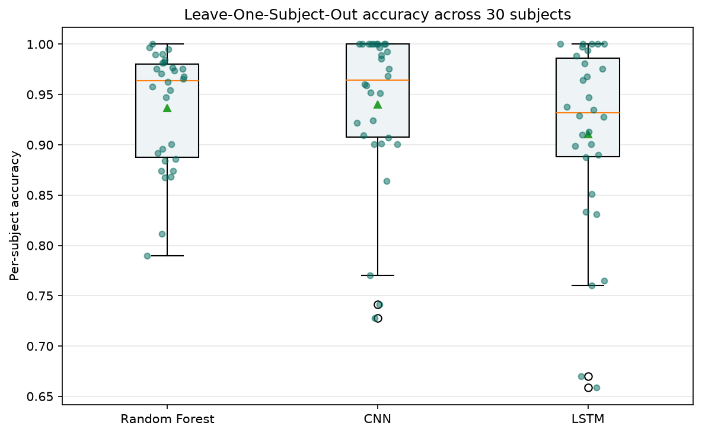
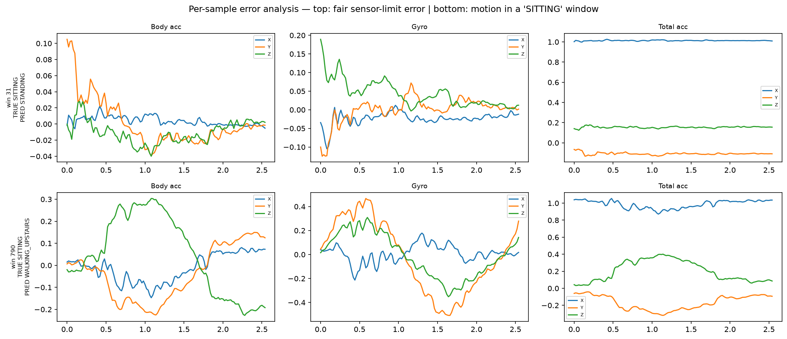

# Phase 4/5 — Advanced Experiments (v2)

*Deeper modeling and evaluation beyond the v1 baseline. Analysis:
[`notebooks/03_advanced.ipynb`](../notebooks/03_advanced.ipynb). All test results are on the
9 unseen test subjects unless a cross-validation is stated.*

## Overview

Six rigor upgrades on top of v1 (RF + CNN + ensemble). The recurring theme: **on a
small-subject dataset, aggressive tuning or claims made on one split/small validation set
overfit; only robust subject-level evaluation is trustworthy.**

## 1. Hyperparameter tuning

- **Random Forest** (GridSearchCV, subject-wise GroupKFold, scored on macro-F1): best
  config was essentially the default (`n_estimators=600, max_features='sqrt'`). Tuned test
  accuracy **0.9264** vs default **0.9287** — a difference far smaller than the ±0.022 CV
  std. **Tuning gave no real gain**; Random Forests are insensitive to it here.
- **CNN** (search over learning rate × dropout, selected on validation): best config
  `lr=5e-4, dropout=0.5` improved test accuracy **0.9335 → 0.9450** (+1.1 pts) by reducing
  overfitting. **Neural nets are far more tuning-sensitive than Random Forests.**

## 2. Second architecture: LSTM

A bidirectional LSTM on the raw signals scored **val macro-F1 0.949** but only **test
0.895** — a large val→test gap. Under LOSO (below) it is the weakest and least stable
model. **Conclusion: for short 2.56 s windows, the CNN generalizes better; the LSTM
overfits to subject-specific patterns.** The CNN's local, translation-invariant filters +
global pooling suit the task; the LSTM's capacity and last-timestep readout do not.

## 3. Validation-tuned ensemble weights (a cautionary tale)

Sweeping the RF/CNN blend weight on the 4-subject validation set chose **w=1.0 (pure RF)**
with the highest validation macro-F1 (0.955) — which then gave the **worst** test score
(0.917). The untuned **equal-weight** ensemble was best (0.948). **Tuning on a tiny
validation set overfit the weight; the untuned prior generalized better.**

## 4. Leave-One-Subject-Out cross-validation (all 30 subjects)

| Model | LOSO accuracy | Worst subject |
|---|---|---|
| CNN | **0.9399 ± 0.0757** | 0.728 |
| Random Forest | **0.9363 ± 0.0572** | 0.789 |
| LSTM | **0.9104 ± 0.0933** | 0.658 |

- **RF and CNN are tied** on average; the CNN's fixed-split edge does not hold across all
  people. **LSTM is clearly weakest** (lowest mean, highest variance).
- **The variance is the real story:** ~94% on average, but the worst subjects fall to
  0.73–0.79 (some, e.g. subject 14, are hard for every model). **For a care application,
  per-subject consistency matters more than the mean** — aggregate accuracy hides that the
  system is much weaker for specific individuals.
- LOSO means match the fixed-split numbers, confirming those were representative.

## 5. Per-sample error analysis

Inspecting individual misclassified windows revealed **two distinct error types**:

1. **Fair sensor-limit errors** (e.g. SITTING→STANDING, confident): the signal is flat and
   upright — physically near-identical to standing. Irreducible with a waist-only sensor.
2. **Windowing / label artifacts** (e.g. SITTING→WALKING_UPSTAIRS, ~21 cases): the window
   contains clear *motion* despite a "SITTING" label — a fixed window straddling an activity
   **transition** (sitting down / standing up). The model's "moving" prediction is
   reasonable; the label does not match the signal.

**Implication:** part of the error rate is a *data/windowing* problem, not model weakness —
the fix is transition-aware windowing, not a bigger model.

## 6. Statistical rigor

- **Bootstrap 95% CIs (test accuracy):** RF **0.9265 [0.917, 0.936]**,
  CNN **0.9450 [0.937, 0.953]**, Ensemble **0.9481 [0.940, 0.956]**. CNN and Ensemble CIs
  overlap heavily (indistinguishable).
- **McNemar (fixed split), CNN vs RF:** p = **0.0002** — "significant".
- **Wilcoxon (LOSO, 30 subjects):** CNN vs RF p = **0.60** (**not** significant — a tie);
  CNN vs LSTM p = **0.0045** (significant).

**Capstone finding:** the fixed split produced a "highly significant" CNN-over-RF result
that **dissolves into a tie under subject-level cross-validation** — it was an artifact of
which subjects were in the test set. The CNN's advantage over the **LSTM**, by contrast, is
statistically real.

## Bottom line

- Best models are **statistically tied** (RF ≈ CNN ≈ equal-weight ensemble ≈ 0.94–0.95);
  the **LSTM is genuinely worse**.
- The dominant limitations are **not model choice** but **(a) per-subject variability**,
  **(b) the sensor's inability to separate sitting from standing**, and **(c) fixed-window
  transition artifacts**.
- Methodologically, v2 repeatedly shows that **single-split / small-validation conclusions
  overfit**, and robust subject-level evaluation (LOSO + paired tests) is essential.
