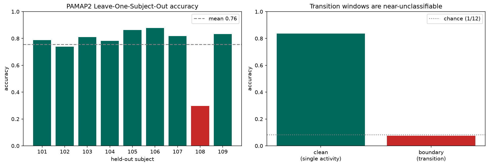

# v3 — PAMAP2 & Transition-Aware Windowing

*Applying the pipeline to a second, harder dataset (PAMAP2) and testing the
transition hypothesis from the UCI HAR error analysis. Analysis:
[`notebooks/04_pamap2.ipynb`](../notebooks/04_pamap2.ipynb).*

## Why PAMAP2

UCI HAR came pre-windowed and pre-cleaned. **PAMAP2 is raw, continuous 100 Hz
recording** — 9 subjects, 12 activities, 3 IMUs (hand, chest, ankle) — so *we* segment
it, which is what lets us test **transition-aware windowing**. It is also messier and
harder, giving a realistic stress-test of the approach.

## Data preparation

- Kept the recommended **±16 g accelerometer + gyroscope** from all 3 IMUs → **18
  channels**; dropped heart rate (90.9% missing), temperature, the saturating ±6 g acc,
  magnetometer, and the invalid orientation columns.
- Interpolated the small IMU NaN gaps (~0.3%), **downsampled 100 Hz → 50 Hz**, and
  segmented into **128-sample (2.56 s) windows** — identical timing to UCI HAR for
  comparability.
- Activity id 0 marks **transient/between-activity** periods (~30% of samples) — the
  built-in transition labels used below.

## Result: subject-independent is much harder here

**Leave-One-Subject-Out CV (CNN, 18ch, 8 subjects):** accuracy **0.756 ± 0.167**.

| Subject | Acc | Subject | Acc |
|---|---|---|---|
| 101 | 0.79 | 106 | 0.88 |
| 102 | 0.74 | 107 | 0.82 |
| 103 | 0.81 | **108** | **0.30** |
| 104 | 0.78 | 109 | 0.83 |
| 105 | 0.86 | | |

- **8 of 9 subjects: 0.74–0.88** (≈0.81 mean, tight). **Subject 108 collapses to 0.30** —
  the model trained on the other 8 people cannot cover 108's motion (a real per-person
  domain shift: body/sensor placement/gait).
- One outlier drags the mean to 0.756 and doubles the variance vs UCI HAR (±0.167 vs
  ±0.076). **For a care application, a system that is near-random for 1 in 9 users is the
  key risk — and only LOSO exposes it.** A single 2-subject split gave 0.59, entirely an
  artifact of whether 108 was in the test set.

## Transition-aware windowing: mechanism confirmed, size context-dependent

Comparing, for the same trained model, clean single-activity windows vs windows that
straddle an activity transition (test subjects 105–106):

| Window type | Accuracy | n |
|---|---|---|
| Clean (single activity) | **0.837** | 4029 |
| Boundary (transition) | **0.075** | 53 |

- **Transition windows are essentially unclassifiable** — 0.075 vs a 12-class chance of
  0.083. A window that spans two activities carries no coherent single-activity signal,
  so the majority label is unrecoverable. **This directly confirms the hypothesis from the
  UCI HAR per-sample error analysis** (the "motion inside a SITTING window" errors).
- **However**, in PAMAP2's long, structured activities only **~1.4%** of windows straddle
  a boundary, so transition-aware windowing lifts *overall* accuracy by only ~1 point.
  **In free-living data with frequent, short activity switches, transitions are far more
  common and this benefit would be much larger.**

## Takeaways (v3)

1. The pipeline transfers to a harder dataset, but subject-independent accuracy drops to
   **~0.81 for typical subjects** (much lower than UCI HAR) with **one catastrophic
   outlier** — reinforcing that **per-subject generalization is the core HAR challenge**.
2. **Transition-straddling windows are near-unclassifiable** — a mechanistic confirmation
   of the v1 error analysis — but their overall impact scales with how often transitions
   occur. Transition-aware windowing is a real, if context-dependent, improvement.
3. The recurring theme across v1–v3 holds: **robust subject-level evaluation is essential;
   aggregate numbers and single splits hide the failures that matter most.**
